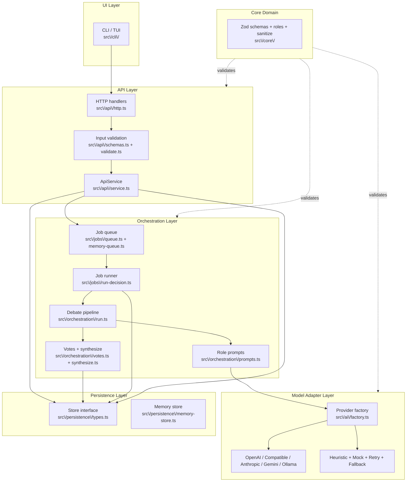

# DebAItable Architecture

This document describes the runtime architecture of DebAItable: an artifact-first, multi-agent decision engine that runs structured debate rounds and emits a validated Decision Record plus a full audit trail.

## Goals

- Artifact-first: the Decision Record is the primary output, not chat text.
- Deterministic JSON outputs validated with Zod at every boundary.
- Auditable: every round and the final record are persisted.
- Small composable modules with I/O kept at boundaries (API, jobs, persistence).

## Layers

## Request Lifecycle

1. UI collects decision input, shows status and timeline (`src/cli/`, `src/cli/tui-ui/`).
2. API validates input, sanitizes it, writes the decision, and enqueues a job (`src/api/service.ts`, `src/api/validate.ts`, `src/core/sanitize.ts`, `src/jobs/queue.ts`).
3. Orchestration runs the debate rounds and validates outputs (`src/jobs/run-decision.ts`, `src/orchestration/run.ts`):
   - Round 1: independent proposals per role.
   - Round 2: critiques and rebuttals.
   - Round 3: convergence and vote (`src/orchestration/votes.ts`, `src/orchestration/synthesize.ts`).
   - Normalization, quality gates, and comparison guardrails apply (`src/orchestration/normalize.ts`, `src/orchestration/quality.ts`, `src/orchestration/comparison.ts`, `src/orchestration/guards.ts`).
4. Persistence stores rounds, run states, decisions, and the final Decision Record (`src/persistence/`).
5. Aggregation returns the Decision Record plus a minority report.

## Roles (MVP)

Defined in `src/core/roles.ts` and `src/core/role-utils.ts`:

- Strategist: long-term value and strategic alignment.
- Skeptic: challenges assumptions and surfaces weaknesses.
- Risk Analyst: failure modes, edge cases, mitigation.
- Execution Planner: steps, dependencies, timeline.
- Cost / ROI: budget constraints and return on investment.

## Data Guarantees

- Every agent output validates against a Zod schema (`src/core/schemas.ts`, `src/orchestration/schemas.ts`, `src/ai/schemas.ts`).
- Output validation rejects non-conforming results (`src/core/validate.ts`, `src/orchestration/validate.ts`, `src/ai/validate.ts`).
- All rounds and the final record are stored for auditability.
- User input is sanitized before prompt injection.
- Minimal PII is stored; raw prompt content is avoided when possible.

## Runtime Adapters

- In-memory queue (`src/jobs/memory-queue.ts`) and in-memory store (`src/persistence/memory-store.ts`) are the default runtime adapters.
- Model adapters (`src/ai/`): `openai`, `generic` / `openai-compatible`, `anthropic`, `gemini`, `ollama`, `heuristic`, `mock`, wrapped by `retry` and `fallback` providers and selected by `src/ai/factory.ts`.
- No external DB or web UI wiring is required for local runs; the CLI saves JSON artifacts under `artifacts/`.

## Further Reading

- `docs/configuration.md` — provider assignments, environment variables, and consensus strategies.
- `README.md` — user-facing setup, CLI usage, and install methods.
- `AGENTS.md` — contributor contract and layered architecture expectations.
